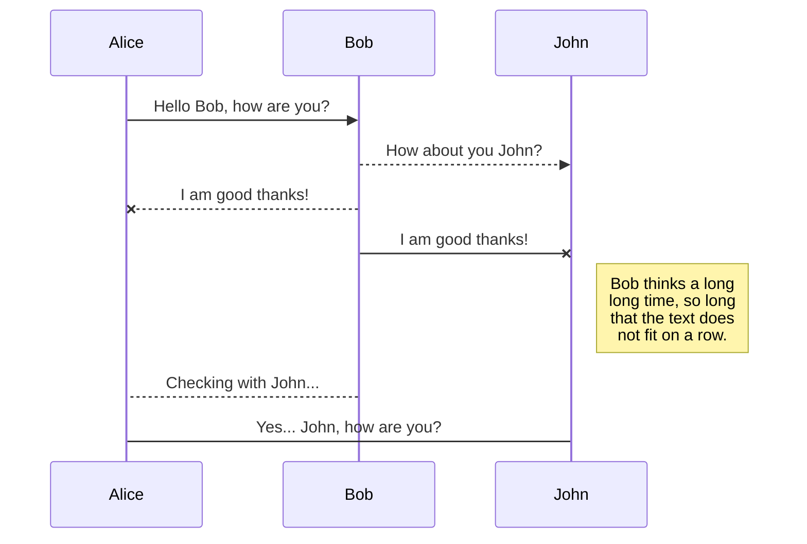
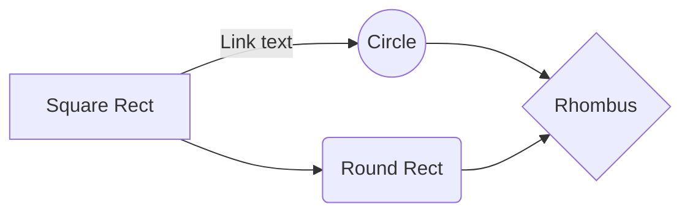

## Useful HPC Debugging Resources

- [SIGSEGV when the client loads the auxiliary library and the auxiliary library invokes printf. · Issue #6500 · DynamoRIO/dynamorio (github.com)](https://github.com/DynamoRIO/dynamorio/issues/6500)
- [CRASH SIGFPE with glibc 2.39 · Issue #6693 · DynamoRIO/dynamorio (github.com)](https://github.com/DynamoRIO/dynamorio/issues/6693)
- [How to downgrade glibc 2.34 to glibc-2.27 - Stack Overflow](https://stackoverflow.com/questions/74089622/how-to-downgrade-glibc-2-34-to-glibc-2-27)
- [How to get a list of images on docker registry v2](https://stackoverflow.com/questions/31251356/how-to-get-a-list-of-images-on-docker-registry-v2)
# Use ghr.io as dockerhub is banned in China
- E.g. ```docker pull ghcr.io/linuxserver/baseimage-ubuntu:noble```
 

## CMDs on HPC-gz (SPEC17)
### Run docker 
```python
 docker run --name sniper -d --privileged=true -v /hpc/home/chengaoshi/developing:/root/developing 10.120.24.15:5000/chengaoshi/ubuntu_22.04:v0  tail -f >/dev/null
 docker exec -it ${container_id} bash
```

### Profile bbvs for SPEC17 Rate (int, fp)
```cpp
./runspec.py -i ref -b all -t 32 --cmd_prefix "/root/developing/qemu/build/qemu-
x86_64 -D log.txt -d plugin -plugin /root/developing/qemu/qemu_plugins_champsim_scripts/build/libbbv2.so,size=1000000000 --"
```
### Compute simpoints from bbvs
```python
#!/bin/bash

# Path to the simpoint binary
SIMPOINT_BIN="/root/developing/qemu/qemu_plugins_champsim_scripts/Simpoint.3.2_fix/bin/simpoint"
# Maximum number of clusters
MAX_K=5

# Find all .bbv files and loop over them
for bbv_file in $(ls benchspec/CPU/*/run/*/result/bbv); do
    # Extract the directory and base name of the bbv file
    output_dir=$(dirname "$bbv_file")
    base_name=$(basename "$bbv_file" .bbv)

    # Define the output file paths
    simpoints_file="${output_dir}/${base_name}.simpoints"
    weights_file="${output_dir}/${base_name}.weights"

    # Run the simpoint command
    "$SIMPOINT_BIN" -maxK "$MAX_K" -loadFVFile "$bbv_file" -saveSimpoints "$simpoints_file" -saveSimpointWeights "$weights_file" >/dev/null

    echo "Processed $bbv_file, saved simpoints to $simpoints_file and weights to $weights_file"
done
```

### Profile omini/rd trace based on simpoints
- Check out github/spec_scripts

##  Debugging Docker env on HPC-gz
  
### enable certains features on qemu (illegal inst)
```python
../configure --target-list=x86_64-linux-user --disable-werror --enable-plugins x86_64-linux-user enable-feature-capstone enable-feature-avx2 enable-feature-avx512bw enable-feature-avx512f enable-feature-kvm && ninja
```
```
gcc -march=native x86-64 (base instruction, need to be distingued with avx extended etc.)
will cause Illegal instruction error
docker  pull  ghcr.io/bartventer/devcontainer-images/base-archlinux:latest
docker  run  -it  --privileged=true  aeed32529d7a  bash
```
  
  

编辑  /etc/pacman.d/mirrorlist，在文件的最顶端添加：

  
```python
Server  =  https://mirrors.tuna.tsinghua.edu.cn/archlinux/$repo/os/$arch
pacman  -Syyu
pacman  -Sy  base-devel  cmake
```
  
  

## rustup

  

echo  'export RUSTUP_UPDATE_ROOT=https://mirrors.tuna.tsinghua.edu.cn/rustup/rustup' >> ~/.bashrc

echo  'export RUSTUP_DIST_SERVER=https://mirrors.tuna.tsinghua.edu.cn/rustup' >> ~/.bashrc

  
  

# cargo.io
```
mkdir  -vp ${CARGO_HOME:-$HOME/.cargo}
cat << EOF | tee  -a ${CARGO_HOME:-$HOME/.cargo}/config

[source.crates-io]
replace-with = 'mirror'

  

[source.mirror]
registry = "https://mirrors.tuna.tsinghua.edu.cn/git/crates.io-index.git"
EOF

docker  run  --name  champsim_test  -d  --privileged=true  -v  /hpc/home/chengaoshi/developing:/root/developing  10.120.24.15:5000/chengaoshi/arch_env:v0  tail  -f >/dev/null
```
# Intall spec2017 in docker
```
My  container  starts  into  bash,  from  this  shell  I  am  able  to  add  loop  devices  using:
mknod /dev/loop0 -m0660 b 7 0
mknod /dev/loop1 -m0660 b 7 1
mknod /dev/loop9 -m0660 b 7 9
```
and  now,  I  have  loop  devices  available,  so  I  am  able  to  mount  an  ISO.  However,  I  noticed  that  the  first  available  loop  device  for  me  was  /dev/loop2:

  
```
bash-4.1#  losetup  -f
/dev/loop2
```
this  implies  that  loop0  and  loop1  are  already  in  use,  this  is  confirmed  by:
```
bash-4.1#  losetup  -a
/dev/loop0: [fd00]:1978974 (/dev/loop0)
/dev/loop1: [fd00]:1978975 (/dev/loop1)
/dev/loop2: [fd00]:2369514 (/path/to/my/iso)
```
  
  ```
  docker kill $id && docker rm $id
  ```
  
  ```
module load cuda/cuda_version
module load **
python -m venv /path/to/new/virtual/environment
pip install -r requirements -i tsinghua_source
 
(base) [chengaoshi@gpu02 ~]$  docker run --name decode_gpu -d --privileged=true --gpus all -v /hpc/home/chengaoshi/:/root 10.120.24.15
:5000/jhinno/lzg_pytorch:latest tail -f >/dev/null
(base) [chengaoshi@gpu02 ~]$ docker exec -it decode_gpu all

source ../pytorch_cuda12.0/bin/activate
  ```
  
 ## Libcachesim + Champsim traces 
 ```python
./bin/cachesim ../data/hmmer_397B.trace.xz_load_ins.csv csv lru 0.001,0.01,0.1,0.2 --ignore-obj-size 1 -t "obj-id-col=6, delimiter=,, has-header=true"
```

```python
 python plot_mrc_size.py --tracepath ../data/hmmer_397B.trace.xz_decode_ins.csv --trace-format csv --trace-format-params="obj-id-col=6,delimiter=," --ignore-obj-size --algos=fifo,lru,lecar,s3fifo
 ```
 *~10-12* GB memory consumption
```python
 python plot_mrc_size.py --tracepath ../data/hmmer_397B.trace.xz_decode_ins.csv --trace-format csv --trace-format-params="obj-id-col=6,delimiter=," --ignore-obj-size --algos=lru,slru,arc,lirs,lhd,tinylfu,s3fifo,sieve --sizes=0.01,0.02,0.05,0.075,0.1,0.15,0.2,0.25,0.3,0.35,0.4,0.5,0.6,0.7,0.8
 ```
*~34-43* GB memory consumption
Please  review  this  file:
```python
 python plot_mrc_size.py --tracepath ../data/hmmer_397B.trace.xz_decode_ins.csv --trace-format csv --trace-format-params="obj-id-col=6,delimiter=," --ignore-obj-size --algos=fifo,lru,lecar,s3fifo --report-interval 120
 ```
"/root/developing/cpu2017/benchspec/CPU/521.wrf_r/build/build_base_arch_x86_test-m64.0000/make.diffwrf_521.out"

## ChampSims
### On usage of prefetchers:
- Enabling prefetchers on L1D and L2C dramatically increase the total simulation runtime (3~9 times)
----------------------------------------------------------------------------

Command  returned  exit  code  2

Error  with  make!

***  Error  building  521.wrf_r  base

Building  526.blender_r  base  arch_x86_test-m64: (build_base_arch_x86_test-m64.0000) [2024-06-26 06:17:29]

Building  527.cam4_r  base  arch_x86_test-m64: (build_base_arch_x86_test-m64.0000) [2024-06-26 06:19:12]

Error  with  make.cam4_r  'specmake --output-sync --jobs=8 build TARGET=cam4_r':

----------------------------------------------------------------------------

Please  review  this  file:

"/root/developing/cpu2017/benchspec/CPU/527.cam4_r/build/build_base_arch_x86_test-m64.0000/make.cam4_r.out"

  

../run_base_refrate_x86_test-m64.0000/xz_r_base.x86_test-m64  cld.tar.xz  160  19cf30ae51eddcbefda78dd06014b4b96  281456e078ca7c13e1c0c9e6aaea8dff3efb4ad6b0456697718cede6bd5454852652806a657bb56e07d61128434b474  59796407  61004416  6

  

./target/release/trace  plugin  -d  -t  "./plugins/simple-cache-simulation/target/release/libsimple_cache_simulation.so -o ./output/cache.txt -i 10000000"  --  /usr/bin/ls

  
  

/root/developing/qemu/build/qemu-x86_64  -D  log.txt  -d  plugin  -plugin  /root/developing/qemu/qemu_plugins_champsim_scripts/build/libbbv2.so,size=100000000  --  /bin/ls

  
  

./runspec.py  -i  ref  -b  all  -t  1  --cmd_prefix  "/root/developing/qemu/build/qemu-x86_64 -D log.txt -d plugin -plugin /root/developing/qemu/qemu_plugins_champsim_scripts/build/libbbv2.so,size=1000000000 -- "

  
  

/root/developing/trace/target/release/trace  plugin  -d  -t  "/root/developing/trace/plugins/jade_trace_export/target/release/libjade_trace_export.so -o ./output"  ../run_base_refrate_x86_test-m64.0000/mcf_r_base.x86_test-m64  --  inp.in

  
  
  

./target/release/trace  plugin  -d  -t  "./plugins/omnitr_export/target/release/libjade_trace_export.so -o ./output"  -ff  1000  -l  100000  /usr/games/stockfish  --  bench  16  1  4  default  depth

  
  
  

For  spec2017  ,521  and  527  building  error:  switch  gcc  version  to  gcc-9

500.perlbench_r/run/run_base_refrate_x86_test-m64.0000/speccmds.cmd

502.gcc_r/run/run_base_refrate_x86_test-m64.0000/speccmds.cmd

503.bwaves_r/run/run_base_refrate_x86_test-m64.0000/speccmds.cmd

505.mcf_r/run/run_base_refrate_x86_test-m64.0000/speccmds.cmd

507.cactuBSSN_r/run/run_base_refrate_x86_test-m64.0000/speccmds.cmd

508.namd_r/run/run_base_refrate_x86_test-m64.0000/speccmds.cmd

510.parest_r/run/run_base_refrate_x86_test-m64.0000/speccmds.cmd

511.povray_r/run/run_base_refrate_x86_test-m64.0000/speccmds.cmd

519.lbm_r/run/run_base_refrate_x86_test-m64.0000/speccmds.cmd

520.omnetpp_r/run/run_base_refrate_x86_test-m64.0000/speccmds.cmd

521.wrf_r/run/run_base_refrate_x86_test-m64.0000/speccmds.cmd

523.xalancbmk_r/run/run_base_refrate_x86_test-m64.0000/speccmds.cmd

525.x264_r/run/run_base_refrate_x86_test-m64.0000/speccmds.cmd

526.blender_r/run/run_base_refrate_x86_test-m64.0000/speccmds.cmd

527.cam4_r/run/run_base_refrate_x86_test-m64.0000/speccmds.cmd

531.deepsjeng_r/run/run_base_refrate_x86_test-m64.0000/speccmds.cmd

538.imagick_r/run/run_base_refrate_x86_test-m64.0000/speccmds.cmd

541.leela_r/run/run_base_refrate_x86_test-m64.0000/speccmds.cmd

544.nab_r/run/run_base_refrate_x86_test-m64.0000/speccmds.cmd

548.exchange2_r/run/run_base_refrate_x86_test-m64.0000/speccmds.cmd

549.fotonik3d_r/run/run_base_refrate_x86_test-m64.0000/speccmds.cmd

554.roms_r/run/run_base_refrate_x86_test-m64.0000/speccmds.cmd

557.xz_r/run/run_base_refrate_x86_test-m64.0000/speccmds.cmd

997.specrand_fr/run/run_base_refrate_x86_test-m64.0000/speccmds.cmd

999.specrand_ir/run/run_base_refrate_x86_test-m64.0000/speccmds.cmd
## Switch to another file

All your files and folders are presented as a tree in the file explorer. You can switch from one to another by clicking a file in the tree.

## Rename a file

You can rename the current file by clicking the file name in the navigation bar or by clicking the **Rename** button in the file explorer.

## Delete a file

You can delete the current file by clicking the **Remove** button in the file explorer. The file will be moved into the **Trash** folder and automatically deleted after 7 days of inactivity.

## Export a file

You can export the current file by clicking **Export to disk** in the menu. You can choose to export the file as plain Markdown, as HTML using a Handlebars template or as a PDF.


# Synchronization

Synchronization is one of the biggest features of StackEdit. It enables you to synchronize any file in your workspace with other files stored in your **Google Drive**, your **Dropbox** and your **GitHub** accounts. This allows you to keep writing on other devices, collaborate with people you share the file with, integrate easily into your workflow... The synchronization mechanism takes place every minute in the background, downloading, merging, and uploading file modifications.

There are two types of synchronization and they can complement each other:

- The workspace synchronization will sync all your files, folders and settings automatically. This will allow you to fetch your workspace on any other device.
	> To start syncing your workspace, just sign in with Google in the menu.

- The file synchronization will keep one file of the workspace synced with one or multiple files in **Google Drive**, **Dropbox** or **GitHub**.
	> Before starting to sync files, you must link an account in the **Synchronize** sub-menu.

## Open a file

You can open a file from **Google Drive**, **Dropbox** or **GitHub** by opening the **Synchronize** sub-menu and clicking **Open from**. Once opened in the workspace, any modification in the file will be automatically synced.

## Save a file

You can save any file of the workspace to **Google Drive**, **Dropbox** or **GitHub** by opening the **Synchronize** sub-menu and clicking **Save on**. Even if a file in the workspace is already synced, you can save it to another location. StackEdit can sync one file with multiple locations and accounts.

## Synchronize a file

Once your file is linked to a synchronized location, StackEdit will periodically synchronize it by downloading/uploading any modification. A merge will be performed if necessary and conflicts will be resolved.

If you just have modified your file and you want to force syncing, click the **Synchronize now** button in the navigation bar.

> **Note:** The **Synchronize now** button is disabled if you have no file to synchronize.

## Manage file synchronization

Since one file can be synced with multiple locations, you can list and manage synchronized locations by clicking **File synchronization** in the **Synchronize** sub-menu. This allows you to list and remove synchronized locations that are linked to your file.


# Publication

Publishing in StackEdit makes it simple for you to publish online your files. Once you're happy with a file, you can publish it to different hosting platforms like **Blogger**, **Dropbox**, **Gist**, **GitHub**, **Google Drive**, **WordPress** and **Zendesk**. With [Handlebars templates](http://handlebarsjs.com/), you have full control over what you export.

> Before starting to publish, you must link an account in the **Publish** sub-menu.

## Publish a File

You can publish your file by opening the **Publish** sub-menu and by clicking **Publish to**. For some locations, you can choose between the following formats:

- Markdown: publish the Markdown text on a website that can interpret it (**GitHub** for instance),
- HTML: publish the file converted to HTML via a Handlebars template (on a blog for example).

## Update a publication

After publishing, StackEdit keeps your file linked to that publication which makes it easy for you to re-publish it. Once you have modified your file and you want to update your publication, click on the **Publish now** button in the navigation bar.

> **Note:** The **Publish now** button is disabled if your file has not been published yet.

## Manage file publication

Since one file can be published to multiple locations, you can list and manage publish locations by clicking **File publication** in the **Publish** sub-menu. This allows you to list and remove publication locations that are linked to your file.


# Markdown extensions

StackEdit extends the standard Markdown syntax by adding extra **Markdown extensions**, providing you with some nice features.

> **ProTip:** You can disable any **Markdown extension** in the **File properties** dialog.


## SmartyPants

SmartyPants converts ASCII punctuation characters into "smart" typographic punctuation HTML entities. For example:

|                |ASCII                          |HTML                         |
|----------------|-------------------------------|-----------------------------|
|Single backticks|`'Isn't this fun?'`            |'Isn't this fun?'            |
|Quotes          |`"Isn't this fun?"`            |"Isn't this fun?"            |
|Dashes          |`-- is en-dash, --- is em-dash`|-- is en-dash, --- is em-dash|


## KaTeX

You can render LaTeX mathematical expressions using [KaTeX](https://khan.github.io/KaTeX/):

The *Gamma function* satisfying $\Gamma(n) = (n-1)!\quad\forall n\in\mathbb N$ is via the Euler integral

$$
\Gamma(z) = \int_0^\infty t^{z-1}e^{-t}dt\,.
$$

> You can find more information about **LaTeX** mathematical expressions [here](http://meta.math.stackexchange.com/questions/5020/mathjax-basic-tutorial-and-quick-reference).


## UML diagrams

You can render UML diagrams using [Mermaid](https://mermaidjs.github.io/). For example, this will produce a sequence diagram:



And this will produce a flow chart:


<!--stackedit_data:
eyJoaXN0b3J5IjpbLTMzMzA3MDYyLDExMTA1NTcwMTIsODg2Mz
c3ODUxLC0xMTAyMTI4NzYxLDcwNjQ2NDg1MSwtMTQzMjMzNzIw
OSwtODYyNzgwNDUwLC0yMDM1NzE0NzM3LC01ODIyODUwOTQsOD
czNTAzMTYxLDE2NjAwNjAyODgsMzk4MjIxNzg5LC0xMTkxMzQ3
MDE4LDE0MTQ2MDMzOTEsMjAyNzA4NDY0NywxODQxMDQ5ODIyLC
0xNDkzNzQ0NjkzLC0xMjU1NTg3MzksLTE1MzI2MTA0OTcsMTU5
MjUxMjA2OV19
-->